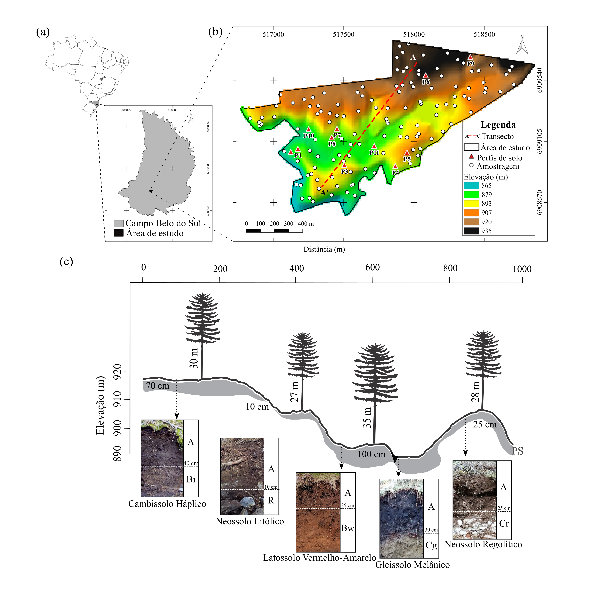
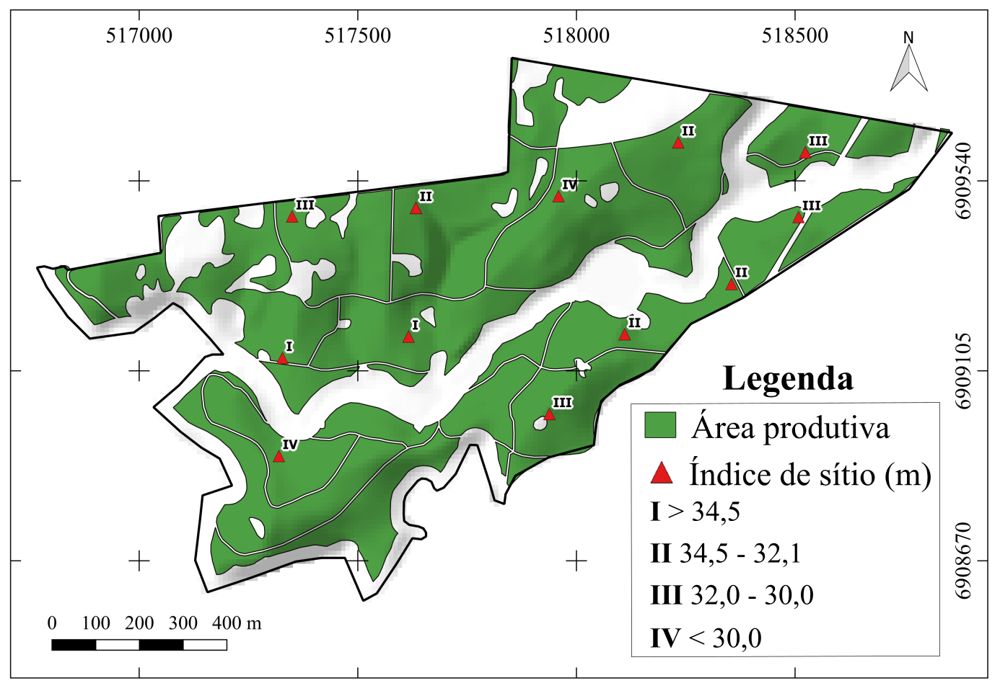

```{r, eval=FALSE}
rmarkdown::render('main.Rmd', encoding = 'UTF-8', output_dir = "../docs")
```

```{r, include=FALSE}
knitr::opts_chunk$set(echo = TRUE)
```

```{r}
rm(list = ls())
# Carregar os Pacotes
library(magrittr)
library(dplyr)
library(glue)
library(lattice)
library(latticeExtra)
library(georob)
library(sp)
library(mapview)
library(raster)
library(rmarkdown)
library(caret)
library(randomForest)
```

```{r}
# Sistemas de referência de coordenadas (Fonte: http://spatialreference.org/ref/epsg/)
wgs84utm22s <- sp::CRS('+proj=utm +zone=22 +south +ellps=WGS84 +datum=WGS84 +units=m +no_defs')
```

*Caracterização dos dados*

Os dados que utilizei para este trabalho são provenientes de um povoamento florestal de 108 ha de $Pinus taeda$ L. de 29 anos. A área pertence ao município de Campo Belo do Sul, região serrana do Estado de Santa Catarina, Brasil. O clima é do tipo Cfb, mesotérmico, subtropical úmido e com precipitação média de 1.647 mm com chuvas bem distribuídas no ano. A geologia regional é constituída por uma sequência vulcânica de rochas ácidas da Formação Serra Geral, com predomínio de riodacito.

Na área foram identificados Neossolos Litólicos e Neossolos Regolíticos, Cambissolos Háplicos e Cambissolos Húmicos, Latossolos Vermelhos e Gleissolos Melânicos, os quais representam a topossequência clássica da área de estudo (Figura 1c). Conforme as tendências observadas no campo, em locais de relevo plano ou suavemente ondulado com boa drenagem estão solos profundos com sequência de horizontes A-Bw (Latossolos), em condições de má drenagem, ocorrem solos com a sequência de horizonte A-Cg (Gleissolos). Nos relevos ondulado ou fortemente ondulado, predominam solos rasos com a sequência de horizontes A ou A-Bi (Neossolos e Cambissolos).

```{r echo=FALSE, out.width='100%'}

```

Figura 1. Localização da área de estudo no município de Campo Belo do Sul, Estado de Santa Catarina (SC), Brasil (a) e área ampliada com modelo digital de elevação e distribuição dos pontos amostrais (b). Relação da classe de solo e altura das árvores de uma Topossequência típica da área de estudo (c).


*Amostragem*

Definimos uma malha amostral contendo 102 pontos para coleta de dados (Figura 1 b). Os pontos foram alocados pelo algoritmo Hipercubo Latino Condicionado (Conditioned Latin Hipercube Sampling – cLHS) através da função $clhs()$ implementado no pacote **clhs**. Foram consideradas como variáveis condicionantes da amostragem ELEV, VD, TWI, CNBL e DECLI as quais, juntas, explicaram aproximadamente 86% da variância topográfica, identificada através da Análise de Componentes Principais (ACP).

Em cada ponto amostral foi medida a profundidade do solum (PF) e a altura das árvores (h). Consideramos solum a espessura máxima do solo onde as raízes podem se desenvolver sem impedimentos físicos para penetração livre das raízes. Os fatores limitantes considerados foram o lençol freático elevado e o contato com rocha consolidada (contato lítico) com ou sem fissuras.
Para representar h utilizamos o valor médio dos quatro indivíduos de *Pinus taeda* mais próximos de cada ponto amostral foram mensurados. Portanto, cada ponto de amostragem representa uma área (bloco) de aproximadamente 10 x 10 metros no campo.

```{r}
pontos <- read.csv('../data/GateadosDados.csv', dec = ".", sep= ";", stringsAsFactors = FALSE)
sp :: coordinates(pontos) <- c('X' , 'Y')
sp :: proj4string(pontos) <- wgs84utm22s #coordenada referencia
pontos <- sp :: spTransform(pontos, wgs84utm22s) #transforma coordenada para wgs84
```

```{r, asp = 1}
ex <- hist(pontos$PFd, breaks = 10, xlab = "", col = "grey90", cex.axis = 1, xlim = c(1, 10), ylim = c(0, 37), ylab = "", main = "")
xfit <- seq(min(pontos$PFd), max(pontos$PFd), length = 50)
yfit <- dnorm(xfit, mean = mean(pontos$PFd), sd = sd(pontos$PFd))
   yfit<-  yfit*diff(ex$mids[1:2])*length(pontos$PFd) 
    lines(xfit, yfit, col="red", lwd=2) 
    mtext("Frequência",line=2.6, side=2, cex=1) 
    mtext("PF (dm)",line=2.6, side=1, cex=1) 
    graphics::rug((pontos$PFd), col="red")
     box()
```

```{r, asp = 1}
ex2 <- graphics::hist(pontos$h, breaks=10, xlab="", col="grey90", cex.axis=1,
          xlim=c(23,38),  ylim=c(0,16),ylab="",main="") 
    xfit<-base::seq(min(pontos$h),max(pontos$h), length=50) 
    yfit<-stats::dnorm(xfit,mean=mean(pontos$h),sd=sd(pontos$h))
   yfit<-  yfit*diff(ex2$mids[1:2])*length(pontos$h) 
    lines(xfit, yfit, col="red", lwd=2) 
    mtext("Frequência",line=2.6, side=2, cex=1) 
    mtext("h (m)",line=2.6, side=1, cex=1) 
    graphics::rug((pontos$h), col="red")
     box()
```


Utilizei o MDE disponibilizado pelo Governo do Estado de SC - Secretaria de Estado do Desenvolvimento Econômico Sustentável, proveniente do Levantamento Aerofotogramétrico em 2010. Os dados, disponibilizados com resolução de 1 metro, foram reamostrados para resolução espacial de 10 metros utilizando a ferramenta $reamostragem$ no software SAGA GIS.

A partir do MDE foram derivadas 12 variáveis topográficas utilizando a ferramenta $Tarrain Analyses$ do software SAGA GIS.

```{r}
ASP <- raster::raster("../data/Covars/ASP.tif")
CNBL <- raster::raster("../data/Covars/CNBL.tif")
DECLI <- raster::raster("../data/Covars/DECLI.tif")
ELEV <- raster::raster("../data/Covars/ELEV.tif")
LS <- raster::raster("../data/Covars/LS.tif")
PLC <- raster::raster("../data/Covars/PLC.tif")
RSP <- raster::raster("../data/Covars/RSP.tif")
TPI <- raster::raster("../data/Covars/TPI.tif")
TRI <- raster::raster("../data/Covars/TRI.tif")
TWI <- raster::raster("../data/Covars/TWI.tif")
VD <- raster::raster("../data/Covars/VD.tif")
VDCN <- raster::raster("../data/Covars/VDCN.tif")
RFPF <- raster::raster("../data/Covars/predictionPF.tif")
Sitio <- raster::raster("../data/Covars/Sitio.tif")
sp::proj4string(Sitio) <- wgs84utm22s
```

A partir da função `extract` implementada no pacote **raster** extração os valores de cada objeto raster nas localizações de cada observação contidas no objeto espacial "pontos".

```{r}
pontos$ASP <- raster::extract(ASP,  pontos)
pontos$CNBL <- raster::extract(CNBL, pontos)
pontos$DECLI <- raster::extract(DECLI, pontos)
pontos$ELEV <- raster::extract(ELEV, pontos)
pontos$LS <- raster::extract(LS, pontos)
pontos$PLC <- raster::extract(PLC, pontos)
pontos$RSP <- raster::extract(RSP, pontos)
pontos$TPI <- raster::extract(TPI, pontos)
pontos$TRI <- raster::extract(TRI, pontos)
pontos$TWI <- raster::extract(TWI, pontos)
pontos$VD <- raster::extract(VD, pontos)
pontos$VDCN <- raster::extract(VDCN, pontos)
pontos$RFPF <- raster::extract(RFPF, pontos)
pontos$Sitio <- raster::extract(Sitio, pontos)

pontos@data
```

Para fins de ordenamento de produção, a área possui 12 parcelas fixas de inventário contínuo (PIC) de 500 metros quadrados cada que são utilizados na estimativa da produtividade local.

Cada PIC é classificada em função da média de altura das 100 árvores de maior per?metro basal da parcela, expressa como altura dominante (Hdom). Em função da Hdom e seus incrimentos anuais é estabelecido o índices de sítio (IS). Esse índice é então atribuido à todo o talhão.

As parcelas da área foram classificação em 4 níveis, em que 1 corresponde ao sítio com melhor produtividade (Figura 2).

```{r echo=FALSE, out.width='100%'}

```
Figura 2 - Área de estudo, com indicação da área produtiva e parcelas de inventário contínuo contento os índices de sítio e respectivos valores de altura dominante


Os níveis de produtividade foram atribuidos aos polígonos e, naquelas em que não existe parcela de PIC, o valor de sítio foi estimado com base na altura das árvores amostradas á campo e das PCIs vizinhas.

Utilizei a função $shapefile$ implementada no pacote **raster** para carregar o polígono da área de estudo - armazenado no objeto `pistola` e o polígono com informações das sítio - armazenado no objeto `ProdutividadePistola`.
A função sp::spTransform foi usada para projetar as coordenadas original no plano cartesiano (UTM).


```{r}
ProdutividadePistola <- 
 raster::shapefile('../data/Produtividade/ProdutividadePistola.shp') %>%
 sp::spTransform(wgs84utm22s)
ProdutividadePistola$Sitio <- as.factor(ProdutividadePistola$Sitio)
```

Usei a função $over$ implementada no pacote **sp** para identificar o nível de produtividade do polígono dentro da qual cada observação se encontra e O resultado foi armazenado em uma coluna definida como `Sitio` no objeto mesmo objeto espacial `pontos`.

```{r}
pontos$Sitio <- sp::over(x = pontos, y = ProdutividadePistola, na.omit = TRUE) %>% unlist()
pontos$Sitio <- as.factor(pontos@data$Sitio)
```

```{r}
sp::spplot(
  ProdutividadePistola, scales = list(draw = T),
  main = 'Localização dos pontos') +
  lattice::xyplot(Y ~ X, data = as.data.frame(pontos@coords),
                  pch = 20, col = 'red', lwd = 2, cex = 1.5) %>%
latticeExtra::as.layer()
```

```{r}
graphics::plot(pontos$Sitio, xlab="Classes de sítios", col="grey90", cex.axis=1,ylab="frequência",main="") 
```

Além dos atributos do terreno, foi utilizado o mapa predito via random forest (RF) utilizando o comando $rf()$ implementado no pacote *caret*, com número padrão de preditores a serem selecionados em cada nó padrão `(mtry = padrão)` e 1000 árvores $(ntrees = 1000)$, utilizando como preditoras as variáveis topográficas oriundas do MDE e as classes de sítio.

Predição por random forest PFd ~ AT + SItio
RMSE Rsquared 2.717759 0.4153228

# Random Forest


```{r}
rf_fit <- caret::train((PFd ~ DECLI + ELEV + ASP + CNBL + DECLI + ELEV + LS + PLC + RSP + TPI + TRI + TWI + VD + VDCN + Sitio), data = pontos@data, method = "rf", tuneLength = 1, ntree = 1000, importance = TRUE, na.action = na.omit, trControl = trainControl("LOOCV"))

rf_fit
```

```{r}
# ASR: O primeiro erro apareceu aqui. Parece ser devido a NAs nos dados de calibração.
pontos@data$rf <- rf_fit$finalModel$predicted
lm(PFd ~ rf, data = pontos) %>% plot()
```


```{r}
grid <- sp::spsample(ProdutividadePistola, 10000, type = 'regular')
plot(grid@coords, asp = 1)
```

```{r}
grid <- 
  sp::SpatialPointsDataFrame(
    coords = grid@coords, 
    data = data.frame(
      ASP = raster::extract(ASP, grid) %>% unlist(),
      CNBL = raster::extract(CNBL, grid) %>% unlist(),
      DECLI = raster::extract(DECLI, grid) %>% unlist(),
      ELEV = raster::extract(ELEV, grid) %>% unlist(),
      LS = raster::extract(LS, grid) %>% unlist(),
      PLC = raster::extract(PLC, grid) %>% unlist(),
      RSP = raster::extract(RSP, grid) %>% unlist(),
      TPI = raster::extract(TPI, grid) %>% unlist(),
      TRI = raster::extract(TRI, grid) %>% unlist(),
      TWI = raster::extract(TWI, grid) %>% unlist(),
      VD = raster::extract(VD, grid) %>% unlist(),
      VDCN = raster::extract(VDCN, grid) %>% unlist(),
      Sitio = raster::extract(Sitio, grid) %>% unlist()),
    proj4string = grid@proj4string)
colnames(grid@coords) <- colnames(pontos@coords)
```

```{r}
grid$pfpredict <- raster::predict(rf_fit, grid)

spplot(grid, "pfpredict")
grid@data
```

```{r}
sp::spplot(RFPF, scales = list(draw = TRUE))

compareRaster(ASP, Sitio)
```


```{r}
rf_fit <- caret::train((PFd ~ DECLI + ELEV + Sitio), data = pontos@data, method = "rf", tuneLength = 1, ntree = 1000, importance = TRUE, na.action = na.omit, trControl = trainControl("LOOCV"))

rf_fit
```


```{r}
beginCluster()
prediction <- 
  clusterR(brick(DECLI, ELEV, Sitio), raster::predict, 
           args = list(model = rf_fit, type = "raw", index = 1))
endCluster()

plot(prediction)
```


*Parte I - Profundidade do solo*

n = 96 observaíes para calibraío + prediío + validaío (108 ha)
Validaío: validaío cruzada (leave-one-out)

**Modelo linear misto de variação espacial (georob)**

Para utilizar esse modelo, supus que os dados são uma realização de um campo aleatório com distribuição normal que podem ser descritos como a combinação aditiva de efeitos fixos, efeitos aleatórios e erro aleatório independente.
Assim, considerei como efeitos fixos da variação da PFd a predição da PF via floresta aleatória, atributos de terreno oriundos do MDE e os índices de sítio.

**Ajuste do variograma:**

```{r fig.asp=1, fig.width=7, fig.height=7}
distmax <-dist(pontos@coords) %>% max() /3

limites <- seq(0, distmax, length.out = 20)
vario<- georob::sample.variogram(PFd ~ RFPF + Sitio,
    data= pontos, locations = ~ X + Y, lag.dist.def = limites, estimator = c( "matheron")) %>%
  plot(annotate.npairs = TRUE)

```

```{r}
lags <- seq(0, distmax, length.out = 12)
georob::sample.variogram(
 PFd ~ RFPF + ELEV + DECLI, data = pontos, locations = ~ X + Y, lag.dist.def = lags,
  xy.angle.def = c(0, 22.5, 67.5, 112.5, 157.5, 180)) %>% 
    plot(type = "b", ylab = 'Semivariância', xlab = 'Distância de separação (km)')
```

Avaliada a evolução da semivariância nas diferentes direções, há evidência da existência de estruturas de autocorrelação espacial dependentes da direção, então o processo espacial é anisotrópico.
Porém, assumi a isotropia do processo espacial e o semivariograma amostral gerado foi independente da direção.

Ajustei ao variograma amostral um modelo exponencial do variograma usando o método dos quadrados mínimos não-lineares ponderados, com ponderação definida conforme o método de Cressie. O processo de estimativa dos parâmetros do modelo exponencial do variograma foi conduzido via otimização usando a função stats::optim(method = "BFGS").

produzidos pelo otimizador a cada 10 iterações:

```{r}
vario_fit <- 
  georob::fit.variogram.model(
  vario, variogram.model = 'RMexp', param = c(variance = 10, nugget = 5, scale = 70), method = "BFGS")


summary(vario_fit)
```

```{r}

plot(vario, type = "b", xlab = 'Distância de separação (m)', ylab = 'Semivariância')
lines(vario_fit, col = "red", lty = 'dashed')
```

Na geoestatística clássica, a variância não explicada é expressa em um único parâmetro `nugget`. Porém, no modelo linear misto podemos separar o parâmetro nugget em dois componentes: a variãncia devida aos erros de medida, modelada pelo parâmetro `nugget` e variância devida à variação espacial em pequena escala, modelada pelo parâmetro `snugget`.
Considerando que durante a obteção dos dados de campo as informações de PF os valores foram arredondadas pelas em decímetros, considerei que a variância do erro de medida é igual a 0.5, ou seja, 62% do parâmetro `nugget`. A variância restante foi atribuída a variação espacial não auto-correlacionada espacialmente - não capturada pelo plano amostral `snugget`.

Feitas essa suposição, ajustei novamente o modelo novamente, agora mantendo ambos nugget e snugget fixos.

```{r}
vario_fit_error <- georob::georob(
    PFd ~ RFPF + ELEV + DECLI, pontos, locations = ~ X + Y, variogram.model = 'RMexp', 
  param = c(variance = vario_fit$variogram.object[[1]]$param[['variance']], 
            nugget = vario_fit$variogram.object[[1]]$param[['nugget']]*0.25,
            snugget = vario_fit$variogram.object[[1]]$param[['nugget']]*0.75,
            scale = vario_fit$variogram.object[[1]]$param[['scale']]),
  fit.param = georob::default.fit.param(nugget = FALSE, snugget = FALSE),
  tuning.psi = 1000, control = georob::control.georob(initial.fixef = 'lm'))
summary(vario_fit_error)
```

```{r}
plot(vario, type = "b", xlab = 'Distância de separação (m)', ylab = 'Semivariância', lty = 'dashed')
lines(vario_fit, col = "navyblue")
lines(vario_fit_error, col = "orange")
```

CRIAR O GRID: Suporte de predição pontual
 
```{r}
grid <- sp::spsample(ProdutividadePistola, 10000, type = 'regular')
colnames(grid@coords) <- colnames(pontos@coords)
```

```{r}
grid$Sitio <- sp::over(grid, ProdutividadePistola)
grid$DECLI <- raster::extract(DECLI, grid)
grid$ELEV <- raster::extract(ELEV, grid)
grid$RFPF <- raster::extract(RFPF, grid)
grid
```

```{r}
grid <- 
  sp::SpatialPointsDataFrame(
    coords = grid@coords, 
    data = data.frame(grid),
    proj4string = grid@proj4string)
colnames(grid@coords) <- colnames(pontos@coords)
```


Argumento type: fazer a predição do sinal "signal" z, "response" se for y ou efeitos fixos "trend"
se quiser predizer erro de medida, y = z + e, então response - signal = erro
se tendência - predito = componente aleatório


Usar control.predict.georob(extended.output = TRUE)

```{r}
pred_ponto <- predict(
  vario_fit_error, newdata = grid, type= "response", signif = 0.95,
  control = georob::control.predict.georob(extended.output = TRUE))
sp::gridded(pred_ponto) <- TRUE
str(pred_ponto)

spplot(pred_ponto)
```

```{r}
at <- pred_ponto@data[, c("pred", "lower", "upper")] %>% range()
sp::spplot(pred_ponto, zcol = c("lower", "pred", "upper"), main = "prediction")
```

```{r}
sp::spplot(pred_ponto, zcol = 'se', main = "SE")
```

```{r}

validacao <- georob::cv(vario_fit_error, nset = 95)
summary(validacao)
1 - sum((validacao$pred$data - validacao$pred$pred)^2) / sum((validacao$pred$data - mean(validacao$pred$data))^2)
plot(validacao)
```


*Parte II - Altura das árvores*

n = 96 observações para calibração + predição + validação (108 ha)
Validação: validação cruzada (leave-one-out)

**Modelo linear misto de variação espacial (georob)**

Para utilizar esse modelo, supus que os dados são uma realização de um campo aleatório com distribuição normal que podem ser descritos como a combinação aditiva de efeitos fixos, efeitos aleatórios e erro aleatório independente.
Assim, considerei como efeitos fixos da variação da h a predição da PF via floresta aleatória, atributos de terreno oriundos do MDE e os índices de sítio.

**Ajuste do variograma:**

```{r fig.asp=1, fig.width=7, fig.height=7}
limites <- seq(0, 2000, length.out = 15)
vario<- georob::sample.variogram(h ~ RFPF + ELEV + DECLI + Sitio,
    data= pontos, locations = ~ X + Y, lag.dist.def = limites, estimator = c( "matheron"),
    mean.angle = TRUE, annotate.npairs = T) %>%
  plot()

```

```{r}
lags <- seq(0, 2000, length.out = 15)
georob::sample.variogram(
 h ~ RFPF + ELEV + DECLI, data = pontos, locations = ~ X + Y, lag.dist.def = lags,
  xy.angle.def = c(0, 22.5, 67.5, 112.5, 157.5, 180)) %>% 
    plot(type = "b", ylab = 'Semivariância', xlab = 'Distância de separação (km)')
```

Avaliada a evolução da semivariância nas diferentes direções, há evidência da existência de estruturas de autocorrelação espacial dependentes da direção, então o processo espacial é anisotrópico.
Porém, assumi a isotropia do processo espacial e o semivariograma amostral gerado foi independente da direção.

Ajustei ao variograma amostral um modelo exponencial do variograma usando o método dos quadrados mínimos não-lineares ponderados, com ponderação definida conforme o método de Cressie. O processo de estimativa dos parâmetros do modelo exponencial do variograma foi conduzido via otimização usando a função stats::optim(method = "BFGS").

produzidos pelo otimizador a cada 10 iterações:

```{r}
vario_fit <- 
  georob::fit.variogram.model(
  vario, variogram.model = 'RMexp', param = c(variance = 9, nugget = 4, scale = 1000), 
  weighting.method =  "npairs", method = "BFGS")


summary(vario_fit)
```

```{r}

plot(vario, type = "b", xlab = 'Distância de separação (m)', ylab = 'Semivariância')
lines(vario_fit, col = "red", lty = 'dashed')
```

Na geoestatística clássica, a variância não explicada é expressa em um único parâmetro `nugget`. Porém, no modelo linear misto podemos separar o parâmetro nugget em dois componentes: a variãncia devida aos erros de medida, modelada pelo parâmetro `nugget` e variância devida à variação espacial em pequena escala, modelada pelo parâmetro `snugget`.
Considerando que durante a obteção dos dados de campo as informações de PF os valores foram arredondadas pelas em decímetros, considerei que a variância do erro de medida é igual a 0.5, ou seja, 62% do parâmetro `nugget`. A variância restante foi atribuída a variação espacial não auto-correlacionada espacialmente - não capturada pelo plano amostral `snugget`.

Feitas essa suposição, ajustei novamente o modelo novamente, agora mantendo ambos nugget e snugget fixos.

```{r}
vario_fit_error <- georob::georob(
    PFd ~ RFPF + ELEV + DECLI, pontos, locations = ~ X + Y, variogram.model = 'RMexp', 
  param = c(variance = vario_fit$variogram.object[[1]]$param[['variance']], 
            nugget = vario_fit$variogram.object[[1]]$param[['nugget']]*0.25,
            snugget = vario_fit$variogram.object[[1]]$param[['nugget']]*0.75,
            scale = vario_fit$variogram.object[[1]]$param[['scale']]),
  fit.param = georob::default.fit.param(nugget = FALSE, snugget = FALSE),
  tuning.psi = 1000, control = georob::control.georob(initial.fixef = 'lm'))
summary(vario_fit_error)
```

```{r}
plot(vario, type = "b", xlab = 'Distância de separação (m)', ylab = 'Semivariância', lty = 'dashed')
lines(vario_fit, col = "navyblue")
lines(vario_fit_error, col = "orange")
```

CRIAR O GRID: Suporte de predição pontual
 
```{r}
grid <- sp::spsample(ProdutividadePistola, 10000, type = 'regular')
colnames(grid@coords) <- colnames(pontos@coords)
```

```{r}
grid$Sitio <- sp::over(grid, ProdutividadePistola)
grid$DECLI <- raster::extract(DECLI, grid)
grid$ELEV <- raster::extract(ELEV, grid)
grid$RFPF <- raster::extract(RFPF, grid)
grid
```

```{r}
grid <- 
  sp::SpatialPointsDataFrame(
    coords = grid@coords, 
    data = data.frame(grid),
    proj4string = grid@proj4string)
colnames(grid@coords) <- colnames(pontos@coords)
```


Argumento type: fazer a predição do sinal "signal" z, "response" se for y ou efeitos fixos "trend"
se quiser predizer erro de medida, y = z + e, então response - signal = erro
se tendência - predito = componente aleatório


Usar control.predict.georob(extended.output = TRUE)

```{r}
pred_ponto <- predict(
  vario_fit_error, newdata = grid, type= "response", signif = 0.95,
  control = georob::control.predict.georob(extended.output = TRUE))
sp::gridded(pred_ponto) <- TRUE
str(pred_ponto)

spplot(pred_ponto)
```

```{r}
at <- pred_ponto@data[, c("pred", "lower", "upper")] %>% range()
sp::spplot(pred_ponto, zcol = c("lower", "pred", "upper"), main = "prediction")
```

```{r}
sp::spplot(pred_ponto, zcol = 'se', main = "SE")
```

```{r}

validacao <- georob::cv(vario_fit_error, nset = 95)
summary(validacao)
1 - sum((validacao$pred$data - validacao$pred$pred)^2) / sum((validacao$pred$data - mean(validacao$pred$data))^2)
plot(validacao)
```

```{r}
## Not run:
data(meuse)
r.logzn.rob <- georob(log(zinc) ~ sqrt(dist) + ffreq, data = meuse, locations = ~ x + y,
variogram.model = "RMexp",
param = c(variance = 0.15, nugget = 0.05, scale = 200),
tuning.psi = 1)
cov2cor(expand(r.logzn.rob[["cov"]][["cov.betahat"]]))
## End(Not run)

```


